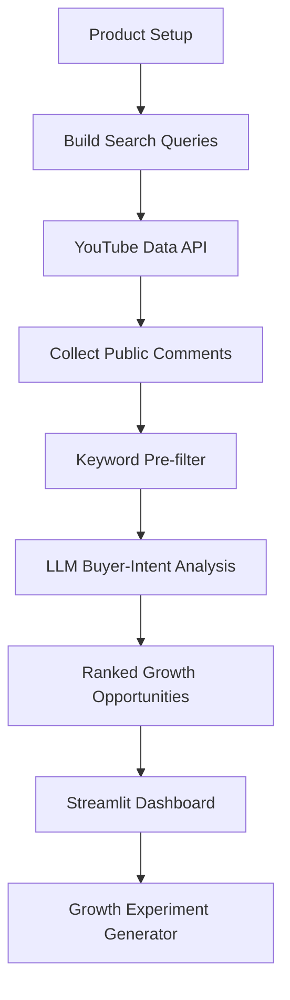
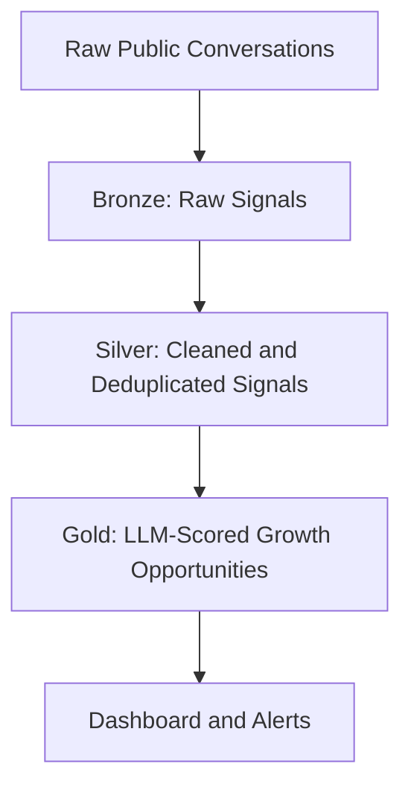

# SignalHunter

**AI-powered buyer-intent and organic growth intelligence for startups.**

SignalHunter helps founders, growth teams, and early-stage B2B startups find public conversations where potential customers are already discussing problems, competitors, alternatives, pricing pain, and product recommendations.

Instead of guessing what content to create or where to engage, SignalHunter searches public conversations, scores buyer intent, identifies pain points, evaluates product fit, and recommends the next organic growth action.

---

## One-Liner

**SignalHunter helps B2B startups find high-intent buyer conversations across the internet and turn them into organic growth experiments.**

---

## What SignalHunter Does

SignalHunter answers four important growth questions:

1. **Where are potential buyers already talking?**
2. **What pain points are they expressing?**
3. **Which competitors are they comparing or complaining about?**
4. **What should we do next to turn that signal into growth?**

Example signal:

> “We currently use Zendesk and are considering Intercom Fin, but pricing is getting difficult at our ticket volume. Are there AI support tools that work with our existing stack?”

SignalHunter analyzes this and returns:

- Intent score
- Buying stage
- Pain point
- Competitors mentioned
- Product fit
- Recommended action
- Suggested organic growth angle
- Growth experiment idea

---

## Why I Built This

Early-stage startups often do not know where their buyers are already talking online.

Most teams either:

- manually search Reddit, YouTube, forums, and communities
- guess content ideas
- copy competitor SEO topics
- run broad social listening tools
- wait for inbound leads

SignalHunter takes a different approach.

It looks for **buyer-intent conversations** — conversations where people are already expressing pain, comparing tools, asking for alternatives, or complaining about competitors.

The goal is not to spam people.  
The goal is to help founders understand where demand already exists and how to respond with useful, credible organic growth actions.

---

## Core Workflow

```text
Product setup
     ↓
Public conversation search
     ↓
Keyword pre-filter
     ↓
AI buyer-intent analysis
     ↓
Product-fit scoring
     ↓
Ranked opportunities
     ↓
Growth experiment generation
```

---

## Features

- Product setup sidebar
- YouTube signal collection
- Buyer-intent keyword pre-filter
- LLM-based conversation analysis
- Intent scoring
- Buying-stage classification
- Competitor mention detection
- Product-fit evaluation
- Recommended organic growth action
- Growth experiment generator
- CSV export
- Streamlit dashboard
- Local `.env` support
- Streamlit Secrets support for deployment

---

## Example Product Setup: MochiAI

```text
Product name:
MochiAI

Category:
AI burnout detector

What does your product do?
An AI powered burnout prediction agent based on voice based journaling.

Who is your target buyer?
B2B

Competitors:
Wysa, Woebot

Verified capabilities:
voice journaling, signal extraction, burnout scores, support capsule to send to managers or HR
```

---

## Example Output

```json
{
  "intent_score": 81,
  "buying_stage": "Active Evaluation",
  "pain_point": "User is looking for alternatives to an existing wellbeing or mental health support tool",
  "competitors_mentioned": ["Wysa", "Woebot"],
  "product_fit": "High",
  "recommended_action": "Educational Response",
  "suggested_angle": "Explain how voice-based journaling can reveal burnout signals that text-only check-ins may miss, while avoiding medical claims."
}
```

---

## Tech Stack

- **Python**
- **Streamlit**
- **Groq API**
- **Groq-supported LLMs**
- **YouTube Data API v3**
- **Pandas**
- **python-dotenv**
- **JSON storage for MVP**

---

## Architecture



---

## Project Structure

```text
signalhunter/
├── app.py
├── analyzer.py
├── collector.py
├── config.py
├── database.py
├── experiment_agent.py
├── product_config.py
├── run_pipeline.py
├── requirements.txt
├── README.md
├── .gitignore
└── data/
    ├── opportunities.json
    └── product_profile.json
```

---

## Setup Locally

### 1. Clone the repository

```bash
git clone https://github.com/harshi606/signalhunter.git
cd signalhunter
```

### 2. Create a virtual environment

```bash
python3 -m venv venv
```

### 3. Activate the virtual environment

On macOS/Linux:

```bash
source venv/bin/activate
```

If activation does not work, run Python directly from the virtual environment:

```bash
venv/bin/python3 -m streamlit run app.py
```

### 4. Install dependencies

```bash
pip install -r requirements.txt
```

---

## Environment Variables

Create a `.env` file in the root folder:

```bash
touch .env
```

Add:

```env
GROQ_API_KEY=your_groq_api_key_here
YOUTUBE_API_KEY=your_youtube_api_key_here
```

Do not commit `.env` to GitHub.

---

## Required API Keys

### Groq API Key

Used for:

- buyer-intent analysis
- buying-stage classification
- product-fit scoring
- growth experiment generation

### YouTube Data API Key

Used for:

- searching public YouTube videos
- collecting top-level public comments
- discovering possible buyer-intent signals

---

## Run the App Locally

```bash
streamlit run app.py
```

Or:

```bash
python -m streamlit run app.py
```

Or, if using the virtual environment directly:

```bash
venv/bin/python3 -m streamlit run app.py
```

The app will open at:

```text
http://localhost:8501
```

---

## How to Use SignalHunter

1. Open the Streamlit app.
2. Fill in the product setup in the sidebar:
   - Product name
   - Category
   - Product description
   - Target buyer
   - Competitors
   - Verified capabilities
3. Click **Save product setup**.
4. Click **Analyze Market Signals**.
5. Review ranked growth opportunities.
6. Select one opportunity.
7. Generate a growth experiment.
8. Download the opportunities as CSV if needed.

---

## Main App Sections

### 1. Product Setup

The sidebar lets the user define the product being analyzed.

SignalHunter needs this context to understand:

- what market to search
- which competitors matter
- who the target buyer is
- what capabilities are verified
- whether a conversation is a realistic product-fit opportunity

### 2. Analyze Market Signals

This button triggers the pipeline inside the Streamlit app.

It collects fresh public conversations, filters possible buyer signals, sends relevant conversations to the LLM, and saves ranked growth opportunities.

### 3. Growth Intelligence Dashboard

The dashboard shows:

- Signals found
- High-intent opportunities
- Average intent score
- High product-fit count
- Ranked growth opportunities

### 4. Opportunity Intelligence

For each opportunity, SignalHunter shows:

- Intent score
- Buying stage
- Pain point
- Competitors mentioned
- Product fit
- Recommended action
- Suggested angle
- Original conversation
- Source link

### 5. Growth Experiment Generator

SignalHunter can turn a selected buyer signal into a small organic growth experiment.

The experiment includes:

- Hypothesis
- Channel
- Experiment
- Success metric
- Duration
- Next action

---

## Responsible Use

SignalHunter is designed to recommend thoughtful organic growth actions, not spam.

The system should not be used for:

- mass automated posting
- scraping private data
- misleading product claims
- harassing users in public communities
- pretending to be a customer
- making unverified product or health claims

The app intentionally separates:

```text
Buyer pain detection
```

from:

```text
Product capability claims
```

The model is instructed not to invent product capabilities. Product-fit reasoning should be based only on verified capabilities provided in the product setup.

For health, wellbeing, or burnout-related products like MochiAI, SignalHunter should avoid medical claims unless they are clinically validated and legally approved.

---

## Deployment on Streamlit Community Cloud

### 1. Push the project to GitHub

Make sure `.env` and `venv/` are not pushed.

Your `.gitignore` should include:

```text
.env
venv/
.venv/
__pycache__/
*.pyc
.DS_Store
```

### 2. Open Streamlit Community Cloud

Deploy the GitHub repository with:

```text
Repository: harshi606/signalhunter
Branch: main
Main file path: app.py
```

### 3. Add Streamlit Secrets

In Streamlit Cloud:

```text
Manage app → Settings → Secrets
```

Add:

```toml
GROQ_API_KEY = "your_groq_api_key_here"
YOUTUBE_API_KEY = "your_youtube_api_key_here"
```

Then reboot the app.

---

## Current MVP Limitations

This is an MVP and has some limitations:

- uses JSON files for storage
- uses YouTube as the first public signal source
- does not yet include user accounts
- does not yet include persistent multi-user storage
- does not yet include billing
- API token limits may restrict repeated runs
- public deployment should limit how many signals are analyzed per run
- current signal quality depends heavily on search query quality and public comment relevance

---

## Future Improvements

Planned improvements:

- Add Reddit signal collection
- Add Hacker News and forum monitoring
- Add RSS/blog signal collection
- Add Supabase database
- Add user accounts
- Add scheduled weekly alerts
- Add email digests
- Add feedback buttons for signal quality
- Add Discoverability Gap dashboard
- Add Stripe billing
- Add workspace-based product profiles
- Add saved growth playbooks
- Add competitor-share tracking
- Add production pipeline using Databricks Lakeflow

---

## Discoverability Gap Concept

A future version of SignalHunter can calculate how often a product appears in relevant buyer conversations compared to its competitors.

Example:

```text
High-intent conversations analyzed: 120

Wysa mentioned: 38
Woebot mentioned: 31
MochiAI mentioned: 0

Discoverability gap:
MochiAI is missing from 100% of relevant high-intent conversations.
```

This helps startups understand not just where buyers are talking, but where the product is absent from the conversation.

---

## Production Architecture Idea

For a production-grade version, SignalHunter can use a Bronze/Silver/Gold data architecture.



Potential production stack:

- Databricks Lakeflow for scheduled ingestion and transformation
- Supabase or Postgres for product/user data
- FastAPI backend
- Streamlit or Next.js frontend
- Scheduled jobs for weekly signal discovery
- Email alerts for high-intent opportunities

---

## Why This Could Become a Startup

SignalHunter can evolve from a demo app into a founder-led growth platform.

The early product could help B2B startups:

- find high-intent conversations
- understand competitor complaints
- discover messaging opportunities
- generate growth experiments
- receive weekly buyer-signal alerts
- track discoverability gaps

The first commercial version could be a weekly AI-assisted growth report:

```text
20 high-intent buyer conversations
+ pain point analysis
+ competitor mentions
+ recommended responses
+ growth experiments
```

This can later become a full SaaS platform.

---

## Author

Built by **Harshithaa Prabu Venkatesh**

GitHub: [harshi606](https://github.com/harshi606)
